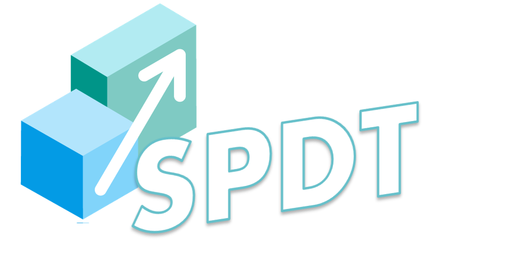

# SPDT
Scaling Policy Derivation Tool

#### Set Up
- Adjust the config.yml file
- Adjust the vm_profiles.json file

#### To RUN
- Run `docker-compose up`

#### CLI Usage:
The configuration file config.yml should be available to execute the following commands.
- `spd derive`
Derives a new scaling policy for the settings specified in the config.yml file
- `spd delete  --pId=<some id>`
Deletes the policy with the specified Id
- `spd policies --all=true`
Retrieves and writes a file with all the policies derived.
- `spd policies --pId=<some id>`
Retrieves and writes a file with the id specified
- `spd policies --start-time=<timestamp> --end-time=<timestamp>`
Retrieves and writes a file with the policies for the time interval specified.
Timestamp should follow the UTC format using seconds. E.g `YYYY-MM-DDTHH:mm:ssZ`

- `spd invalidate  --start-time=<timestamp> --end-time=<timestamp>`
Invalidates all the polices for a time window. Then, derive and schedule new ones.

#### Test using mock services
To test use the mocks in /test
go run mock_services.go

#### Code Documentation:
- Run `godoc -http=":6060"` inside document folder.
- Go to [http://localhost:6060/pkg/github.com/Cloud-Pie/SPDT/](http://localhost:6060/pkg/github.com/Cloud-Pie/SPDT)
